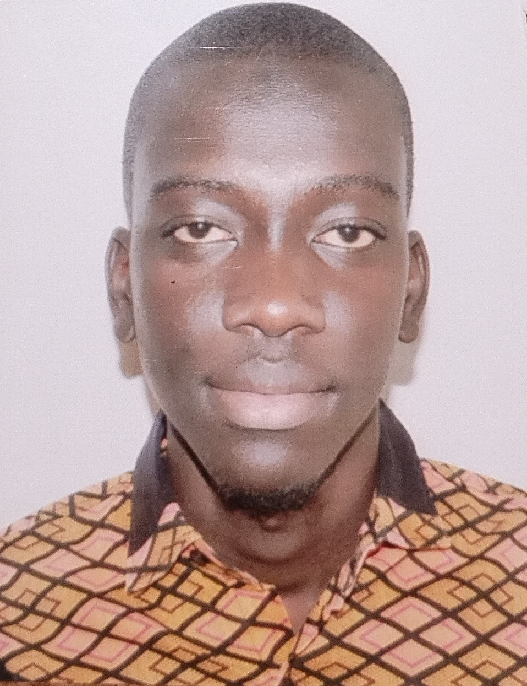

  

<h2 align="center">
  Software Development Student · Web Developer · Future Software Engineer 🇸🇳
</h2>

  <strong>ISI Keur Massar · Dakar, Senegal</strong>

  
  
  

---

## 👋 About Me

Étudiant en **Développement Logiciel à l'ISI Keur Massar**, je viens de terminer ma **2ème année**.

Passionné par le **développement logiciel, le web, les bases de données, les réseaux et la conception logicielle**, je transforme mes connaissances en projets concrets.

🎯 **Objectif : devenir Software Engineer et construire des solutions utiles, sécurisées et évolutives.**

---

## 🧠 Tech Stack

  

---

## 🚀 Skills

💻 <strong>Software Development</strong>

- Java · Python · C++
- Programmation Orientée Objet
- Algorithmique & structures de données
- Applications console
- JDBC
- Conception logicielle

🌐 <strong>Web Development & WordPress</strong>

- HTML5 · CSS3 · PHP
- Responsive Design
- CRUD
- WordPress · Elementor
- Création et personnalisation de sites web

🗄️ <strong>Database</strong>

- SQL · MySQL
- Modélisation des données
- CRUD
- Relations entre tables
- Connexion application ↔ base de données

🧩 <strong>UML & Software Design</strong>

- Analyse et conception logicielle
- Diagrammes UML
- Diagrammes de classes
- Modélisation des systèmes
- Visual Paradigm

🌐 <strong>Networks</strong>

- Architecture réseau
- Protocoles réseau
- Adressage IP
- Modèles OSI & TCP/IP

📊 <strong>Accounting</strong>

- Comptabilité générale
- Comptabilité analytique
- Analyse des données comptables

⚖️ <strong>ICT Law</strong>

- Droit des technologies de l'information et de la communication
- Protection des données
- Responsabilités liées aux systèmes informatiques

---

## 🛠️ Tools

`Git` · `GitHub` · `VS Code` · `Visual Paradigm` · `StarUML` · `draw.io` · `Laragon`

---

## 📂 Featured Projects

### 🌐 01 · ISI Year 1 — Web Projects

  <a href="https://github.com/Maxi-prime/ISI-Year1-web-projects" target="_blank" rel="noopener noreferrer">
    <strong>➡️ View Project</strong>
  </a>

Web projects and practical exercises completed during my first year.

`HTML` `CSS` `PHP` `MySQL`

---

### 💻 02 · ISI Year 2 — Projects

  <a href="https://github.com/Maxi-prime/ISI-Year2-web-projects" target="_blank" rel="noopener noreferrer">
    <strong>➡️ View Project</strong>
  </a>

Programming projects and practical work completed during my second year.

`Python` `Java` `C++` `SQL` `MySQL`

---

### 🏆 03 · Sports Competition Management

Application console developed with **Java, JDBC and MySQL** in the context of the **Dakar 2026 Youth Olympic Games**.

`Java` `JDBC` `MySQL` `UML`

**Management:**  
`Users` · `Countries` · `Disciplines` · `Athletes` · `Competitions` · `Results`

---

## 📚 Currently Learning

`Software Engineering` · `Cybersecurity` · `Advanced Web Development` · `Database Systems` · `Automation`

---

## 🎯 Career Goal

> **Build software. Solve problems. Keep improving.**

Mon objectif est de devenir un **Software Engineer** capable de participer à toutes les étapes d'un projet :

**Analyse → Conception → Développement → Tests → Déploiement**

🔎 **Open to internships, collaborative projects and professional opportunities.**

---

## 📫 Contact

📍 **Dakar, Senegal**

💻 **GitHub :**  
<a href="https://github.com/Maxi-prime" target="_blank" rel="noopener noreferrer">Maxi-prime</a>

💼 **LinkedIn :**  
<a href="https://www.linkedin.com/in/magueye-sane-mbaye-a584713aa/" target="_blank" rel="noopener noreferrer">Magueye Sane Mbaye</a>

📧 **Email :**  
<a href="mailto:magueyesanembaye2001@gmail.com">magueyesanembaye2001@gmail.com</a>

---

⭐ Learn · Build · Solve · Improve 🚀

